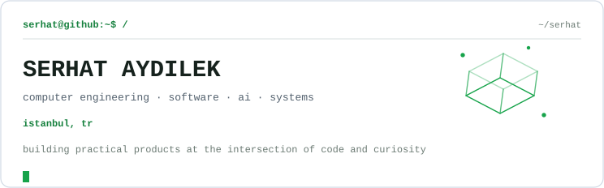
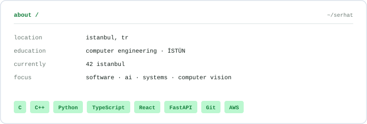
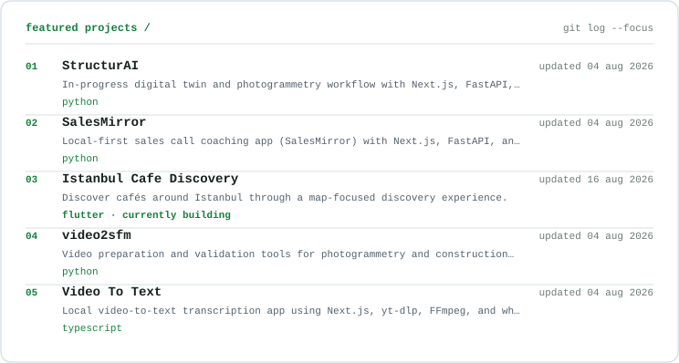
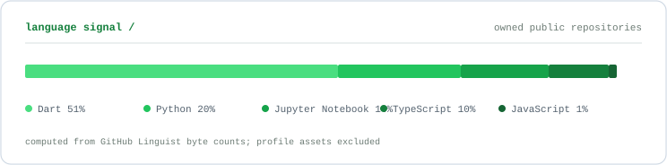
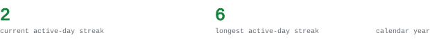
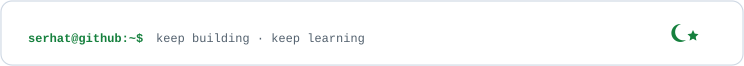

  <a href="https://github.com/serhataydilek/structurAI">StructurAI</a> ·
  <a href="https://github.com/serhataydilek/salescallAI">SalesMirror</a> ·
  <a href="https://github.com/serhataydilek/construction_video">video2sfm</a> ·
  <a href="https://github.com/serhataydilek/videototext">Video To Text</a> ·
  <a href="https://www.linkedin.com/in/serhat-aydilek-a50873371">LinkedIn</a> ·
  <a href="mailto:serhat.aydilek.dev@gmail.com">email</a>

