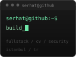

<picture>
  <source media="(prefers-color-scheme: dark)" srcset="assets/terminal-dark.svg">
  <source media="(prefers-color-scheme: light)" srcset="assets/terminal-light.svg">
  
</picture>

### Hey!

👋 I'm **Serhat**.

💻 Computer Engineering student building full-stack, computer vision, security, and mobile projects.

🧩 Studying at **İSTÜN**, training at **42 Istanbul**, and contributing to web development at **SmartSites Construction**.

  · 📍 Istanbul, Türkiye

 

#### ⚡ At a glance

I work across frontend, backend, computer vision, media processing, and security-oriented systems. 
Computer Engineering at **İSTÜN** · **42 Istanbul** · web development at **SmartSites Construction**. 
Completed an Information Security internship at **Ziraat Katılım Bank**.

#### 🌀 Projects

| **Full-stack & Vision** | **Systems & Security** |
| --- | --- |
| • [**Structura AI**](https://github.com/serhataydilek/structurAI) — *In Progress* Digital twin and photogrammetry workflow for construction capture. `Next.js` · `FastAPI` · `COLMAP` · `TypeScript` | • [**Construction Video**](https://github.com/serhataydilek/construction_video) — *Demo Ready* Frame preparation and validation tools for photogrammetry workflows. `Python` · `OpenCV` · `COLMAP` |
| • [**SalesMirror**](https://github.com/serhataydilek/salescallAI) — *Demo Ready* Local-first sales call coaching and reporting application. `Next.js` · `FastAPI` · `SQLite` | • [**vulnScanner**](https://github.com/serhataydilek/vulnScanner) Educational web vulnerability scanner with explainable checks. `React` · `Express` · `SQLite` |
| • [**Video To Text**](https://github.com/serhataydilek/videototext) — *Demo Ready* Local video transcription with Next.js, FFmpeg, yt-dlp, and whisper.cpp. `Next.js` · `TypeScript` · `FFmpeg` · `whisper.cpp` | • [**PhishGuard**](https://github.com/serhataydilek/PhishGuard) — *Prototype* Frontend prototype for heuristic phishing checks. `React` · `Vite` |

#### 🛠️ What am I working on?

| **Category** | **Description** |
| --- | --- |
| **Building** | [Structura AI](https://github.com/serhataydilek/structurAI) and practical full-stack projects |
| **Contributing** | Web development at SmartSites Construction |
| **Learning** | Node.js fundamentals, C, and the 42 curriculum |
| **Exploring** | Computer vision, building automation, security, and local AI |

#### 🔧 Toolbox

**Frontend:** TypeScript · JavaScript · React · Next.js 
**Backend & systems:** Python · FastAPI · REST APIs · Linux · Docker · Git 
**Vision & media:** OpenCV · FFmpeg · COLMAP · Server-Sent Events

---

<b>~</b> <a href="mailto:serhat.aydilek.dev@gmail.com">serhat.aydilek.dev@gmail.com</a>

